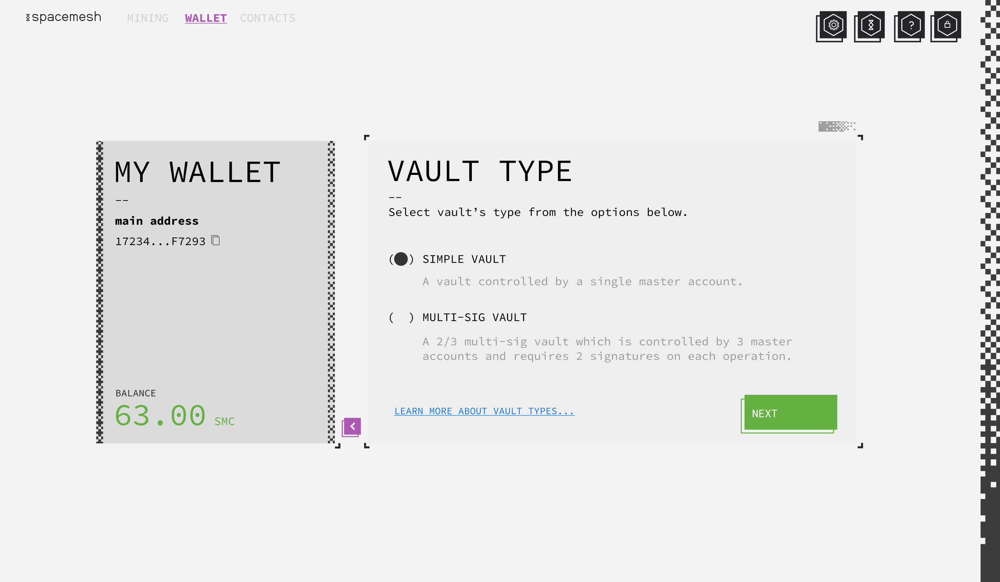
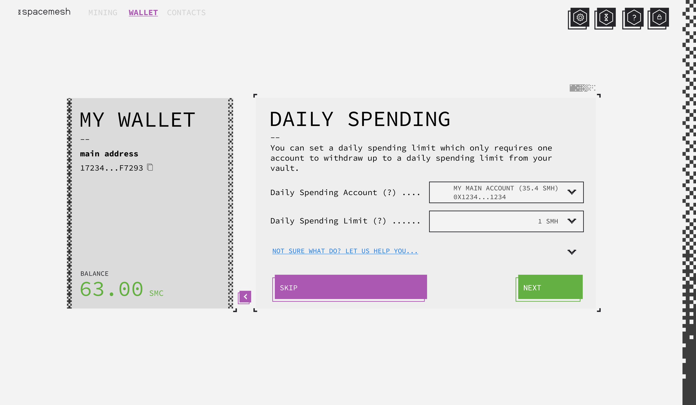
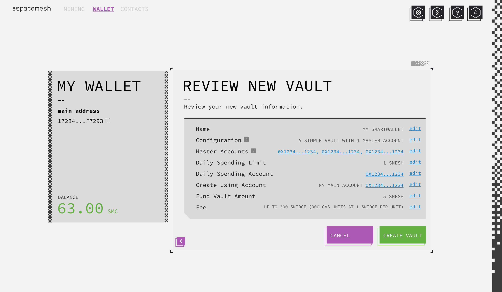

# Vaults in Smapp

> This document is WIP draft and is under heavy modifications

This document describes the main flows of creating and working with vaults in smapp.

Vaults is the only app which users can create and use in the first version of the Spacemesh mainnet.

Vaults is an advanced feature which showcase the power of the Spacemesh VM and smart contracts. It is designed to provide enhance security and capabilities for working with coins on the Spacemesh platform use cases.

Vaults also work with Ledger hardware wallet.

## Definitions

### Vault
A Spacemesh vault smart contract instance which is deployed from the vault's code template. The code template will be automatically deployed at genesis time of the Spacemesh network.

### A Simple Vault
A vault with one master account is fully controlled by the master account owner and he doesn't need authorization from anyone else to perform any operation such as withdraw, set daily spending limit and set daily spending account.

### A Multi Sig Vault
A vault configured with 3 master accounts. Operations are initiated by one master account owner and require approval of additional one master account owner on the following operations: withdraw, set daily spending limit and set daily spending account. A 3 master accounts vaults is similar to the concept of 2 out of 3 multi-sig wallet.

### Genesis Deployed Vaults
These vaults are deployed at genesis time to a Spacemesh network from data in the network's genesis config file. These vaults provide vesting capabilities.

### User Created Vaults
These vaults are created by users using a create transaction. Vesting features are not supported for user-created smart wallets. A new vault is created via a special transaction called `spawn-app` transaction. The user which creates and submits this transaction specifies his new vault's configuration and funding amount using the flow described below in smapp or in any other Spacemesh wallet app.

## Creating a Vault In Smapp - User Interactions

From a user-perspective a vault is a special account that is added to an existing wallet. The wallet can be a hot-wallet or a ledger hardware device wallet. When a vault is added to a hot-wallet, it is created by a wallet's hot address and operations on the vault in the basic use-case also use the wallet's hot addresses. When a vault is added to a ledger wallet, it is created using a hardware-wallet secured address and transaction and operations in the simple use case are performed by the user using a hardware wallet address.

### Step 1 - Set Vault Name

1. User starts the new vault interaction by clicking new vault from his wallet's addresses drop down or from the wallet's settings.

2. App displays the new vault screen.

3. User names the vault and clicks next.

### Step 2 - Set Vault Type

1. User selects `simple vault` or `multi-sig vault` and clicks `next`.

A simple vault is a vault which is controlled by one master account. A multi-sig vault is a vault which requires 2 signatures from 3 master accounts.

### Step 3 - Set Simple Vault Master Account

- User's goal to specify the vault's master account.
- The dropdown should display all the accounts which were created in the wallet as well as an entry for each of the wallet's contracts.
- User should be able to paste any address. This allows users to create a vault which is controlled by any address - not just addresses in his wallet.

### Step 3 - Set Multi-sig Vault Master Accounts

- User's goal to specify the vault's 3 master accounts.
- The drop-down should include all the wallet's accounts as well as contacts accounts.
- User should be able to paste an address into each of the 3 addresses fields.
- User should be able to save the vault information and continue the setup at a later time. This is needed as he may need to gather addresses from other uses that he wishes to setup the vault together with.
- User clicks `Next` when 3 accounts have been set.

### Step 4 - Set Daily Spending

- User can set a daily spending limit and account and should be able to skip this optional step.
- User should be able to select any of his wallet's account or a contact account as the daily spending account. He should also be able to paste any address to set it as the daily spending account.
- User should be able to set the daily spending limit in coin units.
- User clicks `Next` after providing an address and a daily spending limit.

### Step 5 - Prepare New Vault Transaction

- User should be able to provide the vault creation transaction required information.
- User selects one of the accounts with non-zero balance in his wallet.
- User should be able set an optional funding amount to be transferred to the vault from the transaction's account.
- User should be able to set the transaction fee.
- User clicks 'Review' when he provided the 3 required data items.

### Step 6 - Review Simple Vault Setup

### Step 6 - Review Multi Sig Vault Setup

### Step 7 - New Vault Confirmation

-----

- User enters the new smart wallet info.
- User clicks on SET to specify 1 or 3 master accounts.
- One of the master accounts should be owned by the user.
- The master account may be on a hardware wallet generated key pair connected via usb to smapp or a standard smapp hot wallet.
- User can optionally set a daily spending account and daily spending limit (only for a single master account wallet). For a 3 master account wallet, spending account and limit can be set later and requires an additional master account approval.
- User sets the funding amount, the account to create the smart wallet with. This should be one of his owned accounts.
- Smart wallet nickname (up to 20 utf-8 chars) is stored on mesh with the new wallet's app instance.

### Step 2 - Set One Master Account

- User sets one of the accounts he owns as the new smart wallet's master account.
- User can switch to set up a 3 master keys wallet (2/3 multi-sig).
- The drop-down should give access to all created user accounts available in the current wallet.
- It should also have a command to create a new account. In this case, the smart wallet master account will be a newly generated account in the current wallet (a new derived account).

### Step 2 - ALT: Set Three Master Accounts

- User sets his owned account as one master account and need to get from the 2 other smart wallet owners the public address they would like to use for the wallet. This can be any valid Spacemesh account.

### Step 3 - Set Spending Account

- This is an optional feature. User can set a daily spending account. This can be any of his existing wallet accounts or a newly generated account created for the purpose of spending.

### Step 4 - Confirm New App

- User reviews all the information he entered and clicks on `create app` when done.

### New App Confirmation

- User is notified that his new smart wallet app creation transaction has been submitted to the Spacemesh network. He will get notified via smapp when the wallet has been created and is ready to use.

### New App Created

- Smapp displays this notification when the new smart wallet transaction was confirmed.
- User can click on `view app` to view his newly created smart wallet.

---

## Smart Wallet App Main Screen

- This is the main smart wallet screen.
- The vesting section is only displayed if the wallet has the vesting feature enabled. For genesis, this is only going to be the case for genesis smart wallets and not for user-created smart wallets. User created smart wallets do not support setting vesting.
- On the left side user can see basic wallet info.
- The advanced section should be collapsed and click-able to be displayed to reduce information overload when looking at this screen. The mock shows the section expanded.
- The `review pending approval request` button should be displayed when is one or more pending approval request for the a 3 master accounts wallet that the user can sign with one of his wallet's account. There are 3 kind of approval operations:
1. a withdrawal request
2. a change to daily spending account
3. A change to daily spending wallet amount in a 3 mast

Clicking on the button should display the first pending operation for user approval (there can be more than 1 pending request - up to 1 per supported operation).

TODO: Add approve transaction screen here for each request.

---

## Smart Wallet Transactions Screen

- This screen displays all transactions related to a smart wallet app. These include the app creation transaction and any transaction sent to the on-mesh app by any account (not just the accounts in the current active wallet).
- Link to `view on explorer` should open the explorer tab in smapp and display the app's transactions. The explore view should be more detailed as it is not limited to the data available to the local node or the API endpoint that smapp is connected to.
- The name of the operation of each transaction is displayed as well as any value associated with the transaction such as a withdrawal or funding.
- Transactions which are pending approval of 1 more master accounts in a 3 master accounts wallet should be displayed as well as some indication that they are pending approval.

---

## My Apps Screen

- List of all user smart wallets. The list should include any app added by the user manually, or any app that the user has created or owns one of its master accounts.
- Clicking on an app displays the app details screen.
- User can create a new app from this screen.
- User can add an existing app (by address) from this screen.
- Newly created apps which have not been confirmed yet are displayed as pending with a link to the pending creation transaction.

## Add an Existing Smart Wallet App

- User pastes an address of any created smart wallet app to add it to his apps.

## Change Daily Spending Account - 1 Master Account

- If the current wallet doesn't ha e the apps' master account then when the user triggers the action that is supposed to display this screen, an error box should be displayed stating that the user is not the owner of the wallet and therefore can't change its daily spending account.

- User can set a new daily spending account. The drop-down should include all existing user owned accounts (derived in current wallet) as well as a command to derive a new account to be set as the spending account.

- A note based on the smart wallet type (1 master key) explains to the user that he doesn't need any authorization to set the spending account (as he must own wallet's the master account).

- Clicking on 'NEXT' should display a transaction confirmation screen where the transaction from account is the app's master account.

## Change Daily Spending Account - 3 Master Accounts

- Similar to the screen for changing the spending account for 1 master accounts wallets, a note is stating that this operation requires approval by 1 more master key.
- Clicking on `next` should show transaction summary screen with execute button.

# Change Daily Spending Amount - 1 Master Account

- Similar to change daily spending account for a 1 master account wallet.

## Change Daily Spending Amount - 3 Master Accounts

- Similar to change daily spending account for a 3 master accounts wallet.

## Withdraw - 1 Master Account

- This is the main method to withdraw funds from a smart wallet. In a 1 master account wallet, this transaction does not require an approval transaction by one of the two other master accounts owners and the funds are withdrawn as soon as the transaction is confirmed.
- Up to the wallet's total balance may be withdrawn.
- Note that for a smart wallet with vesting, only up to the available for withdrawal amount may be withdrawn.

## Withdraw - 3 Master Accounts

- This is the main method to withdraw funds from a smart wallet. In a 3 master accounts wallet, this transaction requires an approval transaction by one of the two other master accounts owners.
- Up to the wallet's total balance can be withdrawn.

---

## Funding a Smart Wallet App
- Funding a smart wallet is done by executing a standard coin transfer transaction with the destination account being the wallet's public address.
- A smart wallet summary screen includes a `Fund` command which trigger this kind of transaction. User can choose source account to fund to be any account available in his wallet.
